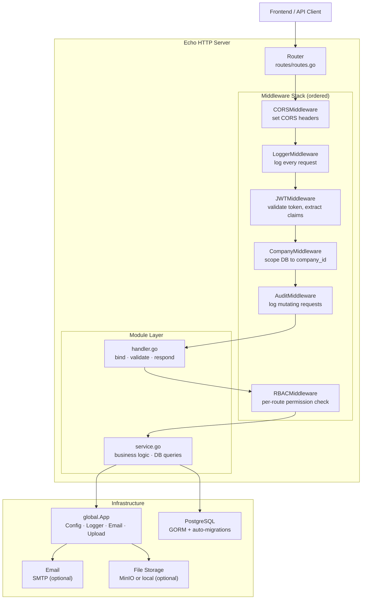
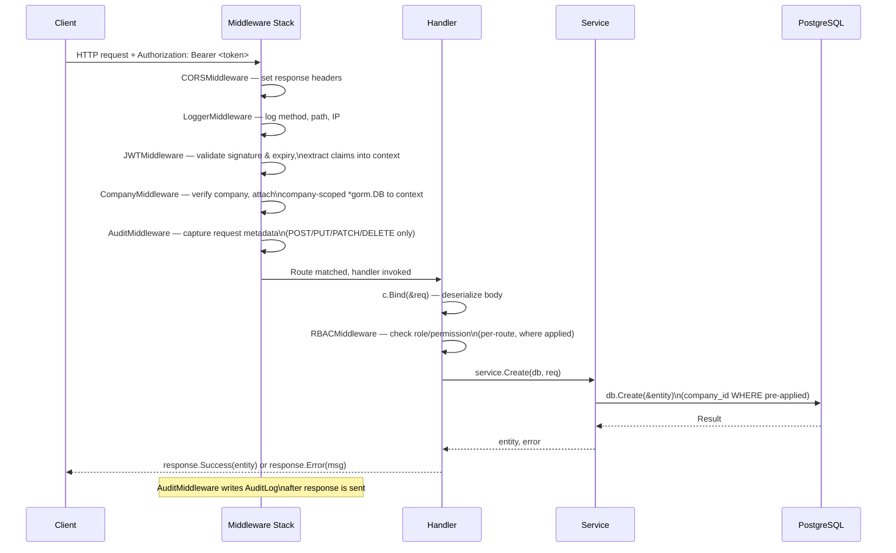
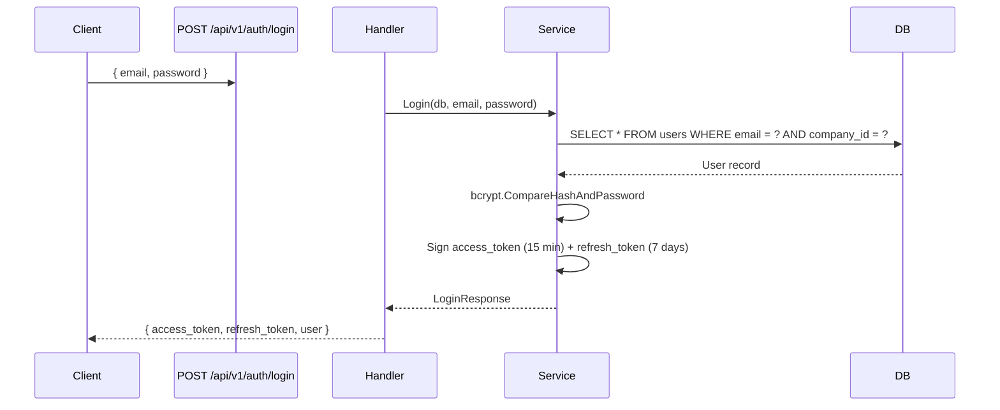
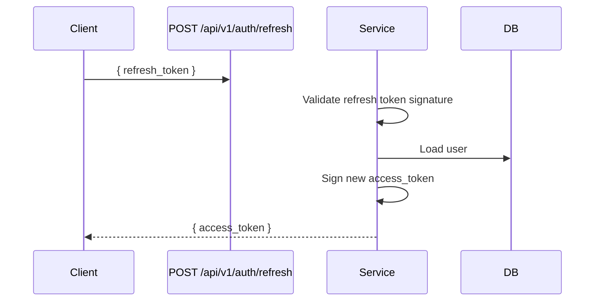
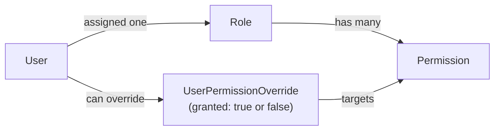

# Geepay Internal Backend — Overview

This document gives a new developer a comprehensive understanding of the Geepay backend: its purpose, architecture, request lifecycle, auth model, database conventions, and module system.

## Table of Contents

1. [Purpose](#purpose)
2. [Core Business Domains](#core-business-domains)
3. [System Architecture](#system-architecture)
4. [Project Structure](#project-structure)
5. [Key Technologies](#key-technologies)
6. [Request Lifecycle](#request-lifecycle)
7. [Authentication and Authorization](#authentication-and-authorization)
8. [Database Architecture](#database-architecture)
9. [Multi-Tenancy](#multi-tenancy)
10. [Module System](#module-system)
11. [External Service Integrations](#external-service-integrations)
12. [Design Principles and Conventions](#design-principles-and-conventions)

---

## Purpose

The Geepay Internal Backend is a REST API server powering the Geepay admin dashboard. It manages:

- Company staff authentication, roles, and fine-grained permissions
- Merchant onboarding, statements, and portal access
- Financial records (budgets, licenses, statutories, salary advances)
- Inventory, incidents, support tickets, and product catalogs
- Platform-level administration (SIM cards, system updates, backups, taxonomy)
- Audit logging, risk & compliance, and soft-delete recovery

The server is **multi-tenant** by default: a single deployment serves multiple companies, with every query automatically scoped to the authenticated company via middleware.

---

## Core Business Domains

| Domain | Module(s) | Key Entities |
|---|---|---|
| Auth & Identity | `auth`, `users`, `rbac` | User, Role, Permission, UserPermissionOverride |
| Merchants | `merchants`, `merchantportal` | Merchant, MerchantStatement, MerchantTicket |
| Finance | `finance` | Budget, License, Statutory, SalaryAdvance |
| Inventory | `inventory` | InventoryItem, InventoryCategory |
| Incidents | `incidents` | Incident, SupportTicket |
| Products | `products` | Product |
| Staff & HR | `stafflisting`, `departments` | Staff, Department |
| Platform Ops | `controlhub`, `sims`, `systemupdates`, `backups`, `taxonomy` | SimCard, SystemUpdate, Backup |
| Governance | `riskcompliance`, `recyclebin` | RiskAndCompliance, RecycleBin |
| Platform Meta | `settings`, `dashboard`, `profile` | Setting, Company, AuditLog |

---

## System Architecture



### Separation of concerns

| Layer | File(s) | Responsibility |
|---|---|---|
| Routing | `routes/routes.go` | Map URL patterns to handler functions |
| Middleware | `middleware/*.go` | Cross-cutting concerns (auth, tenancy, audit) |
| Handler | `modules/<name>/handler.go` | Bind request body, call service, return response |
| Service | `modules/<name>/service.go` | Business logic and database queries |
| DTO | `modules/<name>/models.go` | Request and response struct definitions |
| Models | `models/*.go` | GORM entity definitions |
| Infrastructure | `global/app.go`, `pkg/` | Config, logging, email, file upload |

Handlers never contain query logic. Services never write HTTP responses. This boundary is strictly enforced.

---

## Project Structure

```
geepay-internal-backend/
├── main.go                    # Entry point — wires all components together
├── Makefile                   # Developer commands
├── docker-compose.yml         # PostgreSQL container definition
├── .env.example               # Configuration template
│
├── db/
│   ├── db.go                  # Connection pool, singleton Manager
│   ├── seeds.go               # Initial data (default company, super admin)
│   └── migrations/            # Numbered SQL files, auto-run on startup
│       ├── 001_core_schema.sql
│       ├── 002_rls_policies.sql
│       ├── 003_example_projects_feature.sql
│       ├── 004_company_admin_schema.sql
│       ├── 005_finance_schema.sql
│       ├── 006_inventory_schema.sql
│       ├── 007_merchants_schema.sql
│       ├── 008_incidents_support_schema.sql
│       ├── 009_products_backups_schema.sql
│       ├── 010_staff_department_schema.sql
│       └── 011_notifications_misc_schema.sql
│
├── models/                    # GORM entity definitions
│   ├── base.go                # BaseModel · CompanyBaseModel
│   ├── user.go                # User · Role · Permission · UserPermissionOverride
│   ├── merchant.go            # Merchant · MerchantStatement
│   ├── finance.go             # Budget · License · Statutory · SalaryAdvance
│   ├── inventory.go           # InventoryItem · InventoryCategory
│   ├── incident_support.go    # Incident · SupportTicket
│   ├── staff.go               # Staff · Department
│   ├── product_backup.go      # Product · Backup
│   ├── audit.go               # AuditLog
│   ├── meta.go                # Company · Setting · RecycleBin
│   └── misc.go                # Report · RiskAndCompliance · SystemUpdate
│
├── middleware/
│   ├── cors.go                # CORS + request logger
│   ├── auth.go                # JWT validation, claims extraction
│   ├── tenant.go              # Company-scoped DB session injection
│   ├── rbac.go                # Role and permission enforcement
│   ├── audit.go               # Automatic state-change logging
│   └── merchant.go            # Merchant portal JWT validation
│
├── modules/                   # Feature modules (18 total)
│   ├── auth/
│   ├── users/
│   ├── merchants/
│   ├── rbac/
│   ├── finance/
│   ├── inventory/
│   ├── products/
│   ├── incidents/
│   ├── stafflisting/
│   ├── departments/
│   ├── dashboard/
│   ├── profile/
│   ├── settings/
│   ├── riskcompliance/
│   ├── recyclebin/
│   ├── sims/
│   ├── systemupdates/
│   ├── backups/
│   ├── taxonomy/
│   ├── merchantportal/
│   ├── controlhub/
│   └── _template/             # Scaffold source for make new-module
│
├── routes/
│   └── routes.go              # All route setup functions
│
├── global/
│   └── app.go                 # App struct · EmailSender · FileUploader interfaces
│
└── pkg/
    ├── config.go              # Config struct, Load(), Validate()
    └── response/
        └── response.go        # Success(), Error() response helpers
```

---

## Key Technologies

| Technology | Version | Role |
|---|---|---|
| Go | 1.25 | Primary language |
| Echo | v4.14 | HTTP framework |
| GORM | v1.31 | ORM with PostgreSQL driver |
| golang-jwt | v5.3 | JWT generation and validation |
| Zap | v1.27 | Structured, leveled logging |
| bcrypt (x/crypto) | latest | Password hashing |
| google/uuid | v1.6 | UUID primary key generation |
| godotenv | v1.5 | `.env` file loading |
| PostgreSQL | 15 | Primary database |
| Docker Compose | — | Local PostgreSQL container |

---

## Request Lifecycle



---

## Authentication and Authorization

### Login flow



### Token refresh



### JWT claims

Every `access_token` carries these claims, extracted by `JWTMiddleware` and stored in the Echo context:

| Claim | Context key | Description |
|---|---|---|
| `user_id` | `user_id` | UUID of the authenticated user |
| `email` | `email` | User's email address |
| `role_slug` | `role_slug` | e.g. `admin`, `viewer` |
| `company_id` | `company_id` | Tenant identifier |
| `user_type` | `user_type` | `staff` or `merchant` |

Handlers and services read these from the Echo context — never decode the token a second time.

### RBAC model



Permission codes follow `resource.action` convention: `users.create`, `merchants.export`, `finance.view`.

Super admins pass all RBAC checks unconditionally.

To protect a route:

```go
g.DELETE("/users/:id", h.Delete,
    middleware.RBACMiddleware(db, logger, "users.delete"))
```

### Merchant portal auth

Merchants authenticate through a separate endpoint and receive tokens with `user_type = "merchant"`. The `MerchantJWTMiddleware` validates these tokens and scopes queries by `merchant_id` instead of `company_id`.

---

## Database Architecture

### Base models

Every entity embeds one of two base models:

```go
// For platform-level, non-tenant entities (Company, Role, Permission)
type BaseModel struct {
    ID        uuid.UUID      `gorm:"type:uuid;primaryKey;default:gen_random_uuid()"`
    CreatedAt time.Time
    UpdatedAt time.Time
    DeletedAt gorm.DeletedAt // Enables soft delete
}

// For all tenant-scoped entities (User, Merchant, Invoice, etc.)
type CompanyBaseModel struct {
    BaseModel
    CompanyID string `gorm:"not null;index"`
}
```

### Soft deletes

GORM automatically adds `WHERE deleted_at IS NULL` to every query. Deleted records are retained in the database with a timestamp. The `recyclebin` module surfaces these records for recovery.

### Migrations

SQL files in `db/migrations/` are numbered and run automatically at startup in filename order. Rules:

- **Never edit an existing migration file.** Schema drift will cause silent failures.
- **Always add changes as a new numbered file** (e.g., `012_contracts_schema.sql`).
- Migrations are idempotent — use `CREATE TABLE IF NOT EXISTS` and `ADD COLUMN IF NOT EXISTS`.

### Connection pooling

| `.env` variable | Default | Description |
|---|---|---|
| `DB_POOL_MAX_OPEN` | 25 | Maximum open connections |
| `DB_POOL_MAX_IDLE` | 5 | Maximum idle connections |

Tune these per environment based on PostgreSQL `max_connections`.

---

## Multi-Tenancy

Every authenticated request goes through `CompanyMiddleware` (in `middleware/tenant.go`):

1. Reads `company_id` from JWT claims
2. Verifies the company exists in the `companies` table
3. Creates a GORM session scoped to that company:
   ```go
   db.Where("company_id = ?", companyID).Session(&gorm.Session{NewDB: false})
   ```
4. Stores this scoped `*gorm.DB` in the Echo context under key `"db"`

Handlers retrieve it:

```go
db := c.Get("db").(*gorm.DB)
```

And pass it to services as a method argument. Because `Session{NewDB: false}` preserves the WHERE clause through `Preload()` and association queries, services **never need to add `WHERE company_id = ?` manually**.

### Single-company mode

Set in `.env`:

```env
MULTI_COMPANY_ENABLED=false
DEFAULT_COMPANY_ID=your-company-uuid
```

The middleware uses the default company for all requests instead of reading from the JWT.

---

## Module System

### Module anatomy

Each module in `modules/<name>/` contains:

| File | Purpose |
|---|---|
| `handler.go` | Echo handlers: bind request → call service → return response |
| `service.go` | Business logic: receives `*global.App` + `*gorm.DB` per method |
| `models.go` | Request/response DTOs |
| `public.go` | Exported constructors (`NewService`, `NewHandler`) used in `main.go` |

### Service dependency injection

```go
// The service struct holds only infrastructure — NEVER the database
type service struct {
    app *global.App
}

// DB is passed per-method call (company-scoped by middleware)
func (s *service) Create(db *gorm.DB, req CreateMerchantRequest) (*models.Merchant, error) {
    merchant := &models.Merchant{
        Name:  req.Name,
        Email: req.Email,
    }
    result := db.Create(merchant) // company_id WHERE clause already applied
    return merchant, result.Error
}
```

Storing `*gorm.DB` on the service struct would break multi-tenancy — the same service instance handles requests from different companies concurrently.

### Response format

All handlers use helpers from `pkg/response/response.go`:

```go
// Success responses
return c.JSON(http.StatusOK, response.Success(data))
return c.JSON(http.StatusOK, response.SuccessWithMessage("Created", data))

// Error responses
return c.JSON(http.StatusBadRequest, response.Error("Invalid request body"))
return c.JSON(http.StatusInternalServerError, response.Error("Failed to create merchant"))
```

Wire format:

```json
{
  "status": 0,
  "message": "success",
  "data": { ... }
}
```

`status: 0` = success, `status: 1` = error.

Never write raw `c.JSON(...)` with a custom struct in a handler.

---

## External Service Integrations

Both external services are optional. The server starts and functions without them.

### Email (`EmailSender` interface)

```go
type EmailSender interface {
    Send(to, subject, body string) error
    SendTemplate(to, template string, data map[string]interface{}) error
}
```

Used by `auth` module for password reset emails. Configure via:

```env
SMTP_HOST=smtp.example.com
SMTP_PORT=587
SMTP_USERNAME=noreply@example.com
SMTP_PASSWORD=secret
SMTP_FROM_EMAIL=noreply@example.com
```

Always nil-check before calling: `if s.app.Email != nil { ... }`

### File Storage (`FileUploader` interface)

```go
type FileUploader interface {
    Upload(file multipart.File, path string) (url string, err error)
    Download(path string) (io.Reader, error)
    Delete(path string) error
    GeneratePresignedURL(path string, expires time.Duration) (string, error)
}
```

Supports local filesystem and MinIO (S3-compatible). Configure via:

```env
FILE_STORAGE_TYPE=local   # or minio
MINIO_URL=http://localhost:9000
MINIO_BUCKET=geepay-files
MINIO_ACCESS_KEY=minioadmin
MINIO_SECRET_KEY=minioadmin
MINIO_PUBLIC_URL=http://localhost:9000
```

---

## Design Principles and Conventions

1. **Handlers are thin.** Bind the request, call one service method, return the response. No query logic in handlers.
2. **Services receive `db` as a method parameter.** Never store `*gorm.DB` on a service struct — it breaks multi-tenancy.
3. **Always use `response.Success` / `response.Error`.** Never write raw `c.JSON(...)` with a custom struct.
4. **All tenant-scoped entities embed `CompanyBaseModel`.** Platform-level entities (Company, Role, Permission) embed `BaseModel`.
5. **Audit logging is automatic.** `AuditMiddleware` covers all POST/PUT/PATCH/DELETE requests — no manual logging in services.
6. **Migrations are append-only.** Never edit existing migration files. Add new numbered files for schema changes.
7. **Super admin bypasses RBAC.** No special-case code in services — the middleware handles it.
8. **Nil-guard optional services.** Check `app.Email != nil` and `app.Upload != nil` before calling.
9. **Use structured logging.** Call `s.app.Logger.Infow(...)` / `.Errorw(...)` with key-value pairs, not fmt.Printf.
10. **Graceful shutdown is built-in.** The server drains connections for up to 30 seconds on SIGTERM.
